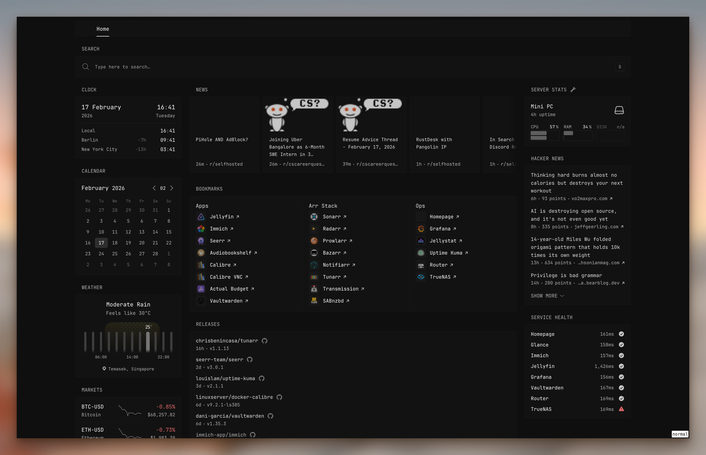
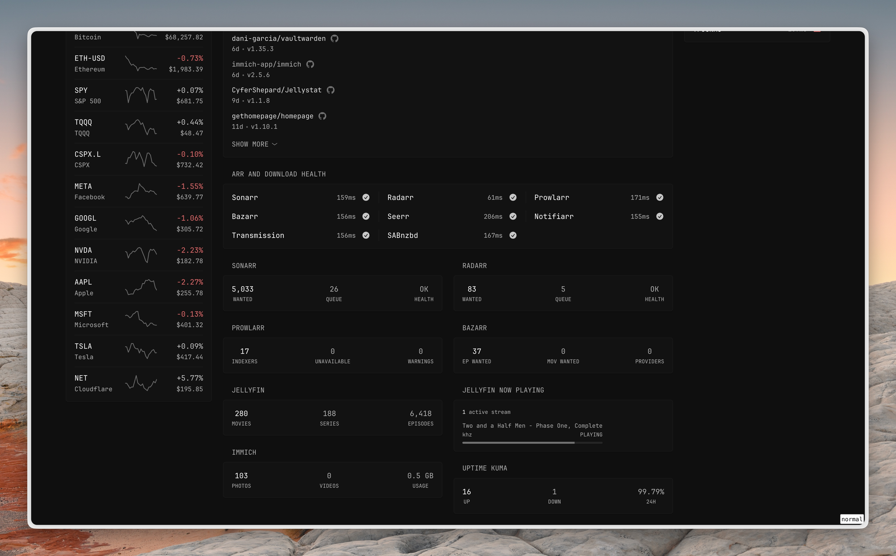
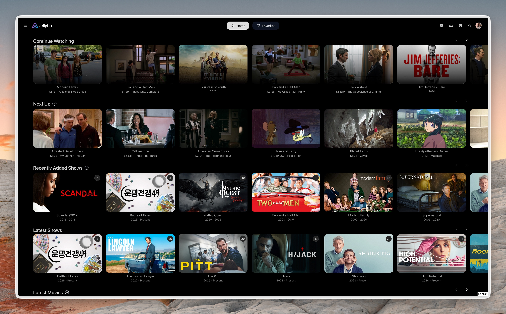
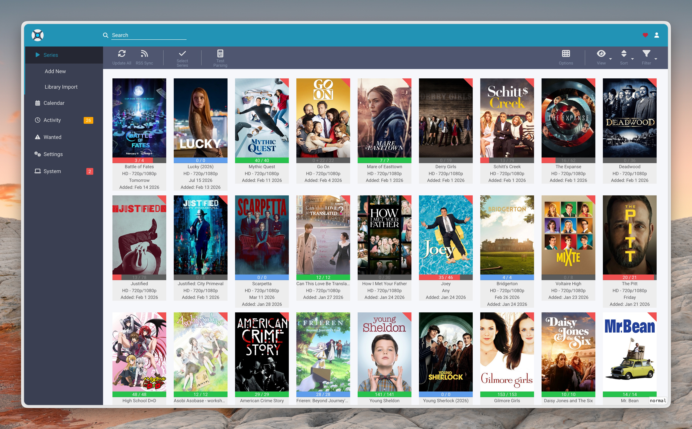
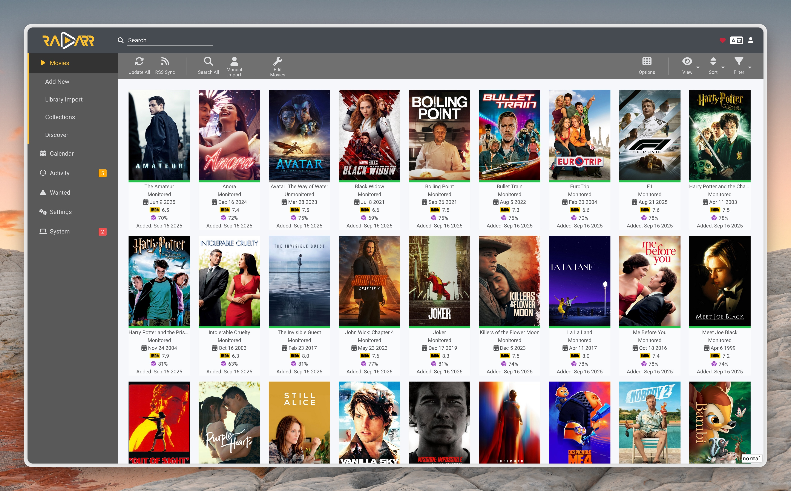
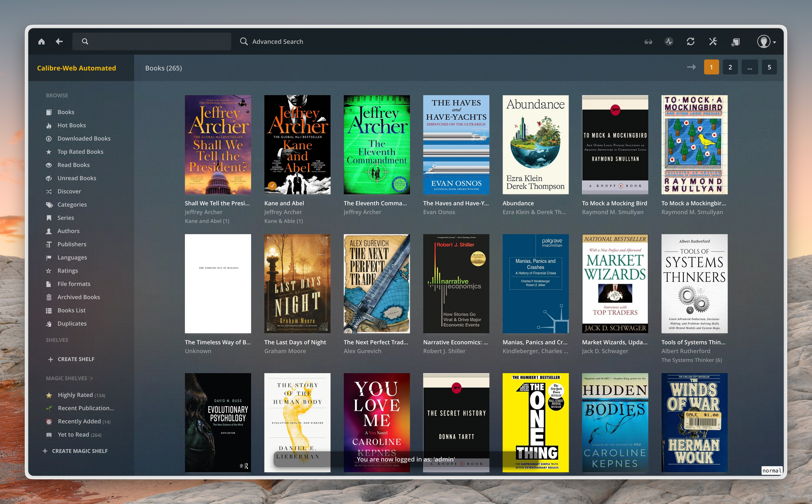
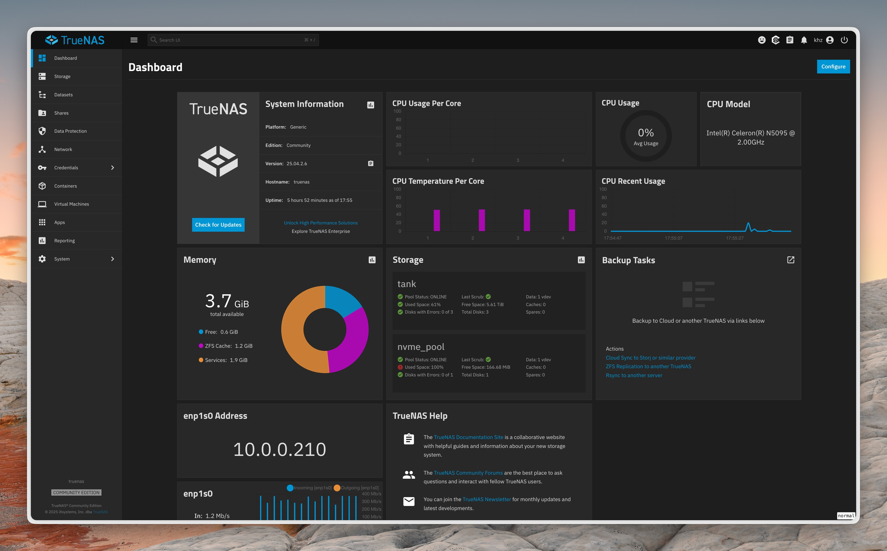
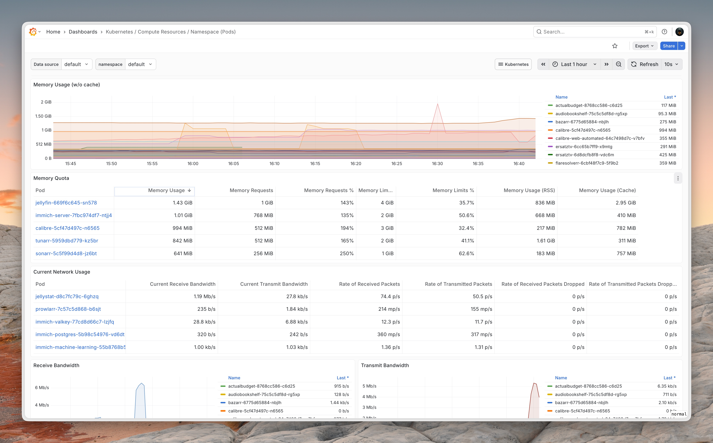
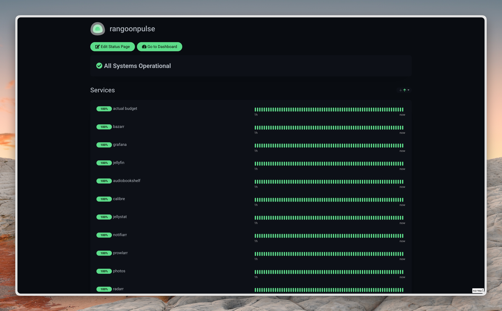

# rangoonpulse

Infrastructure-as-code for my homelab Kubernetes cluster, managed with Flux CD GitOps.

- 🌐 Unified access: LAN + Tailscale clients both hit ingress at `10.0.0.231`
- 🖥️ Single-node Talos cluster: i5-8400T (6c/6t), 32 GiB RAM, NVMe + Intel iGPU (`/dev/dri`)

## ✨ Highlights

- GitOps-first: everything reconciles via Flux (`Kustomization` + `HelmRelease`).
- One ingress VIP for LAN and remote (Tailscale subnet routing; no separate tailnet ingress proxy).
- Storage policy: prefer NAS-backed PVCs; use `local-path` only when it’s clearly the better option (DBs, SQLite, hot caches).
- Automated tuning: in-cluster Resource Advisor CronJobs generate safe, budgeted resource PRs.

## 🧱 Stack

- Talos Linux + Kubernetes
- Flux CD v2
- Helm + Kustomize
- ingress-nginx + MetalLB
- Cloudflare DNS + external-dns + cert-manager (Let's Encrypt)
- Tailscale operator + subnet router (`Connector`)
- Storage: TrueNAS SCALE NFS via democratic-csi, plus `local-path` when justified
- Monitoring: Prometheus + Grafana
- Dashboard: Glance
- Uptime: Uptime Kuma

## 🧩 Services (Private)

These are only reachable from my LAN or approved devices (Tailscale). I intentionally don't publish service links here.

- Glance (dashboard)
- Jellyfin (media)
- Immich (photos)
- Seerr (requests)
- Grafana (monitoring)
- Uptime Kuma (status)
- Tracearr
- ChartDB
- nodecast-tv
- iSponsorBlockTV
- Profilarr
- autobrr

## 🛠️ Ops Cheatsheet

```bash
# Flux health
flux get kustomizations
flux get hr -A

# Reconcile a component
flux reconcile kustomization <name> --with-source

# Cluster triage
kubectl get pods -A
kubectl get events -A --sort-by=.lastTimestamp | tail -n 50
```

Gotcha:
- If NFS PVCs suddenly fail, check the TrueNAS Tailscale app has **"Accept Routes" disabled** to avoid asymmetric routing.

## 📸 Screenshots

### Dashboard (Glance)





### Jellyfin




### Sonarr



### Radarr



### Calibre



### NAS



### Grafana



### Uptime


