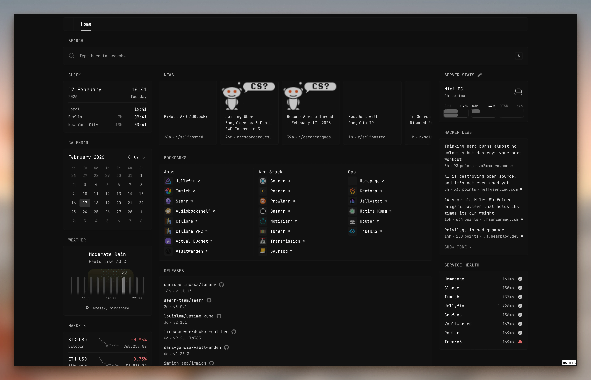
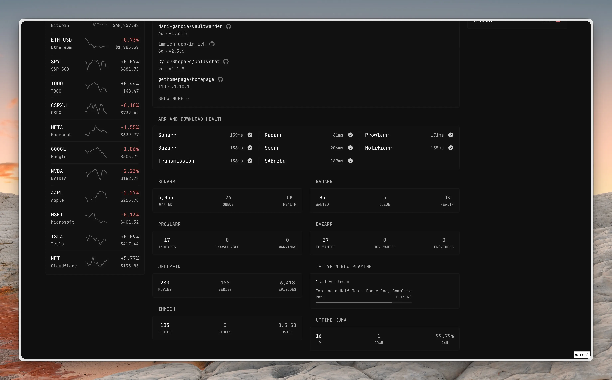
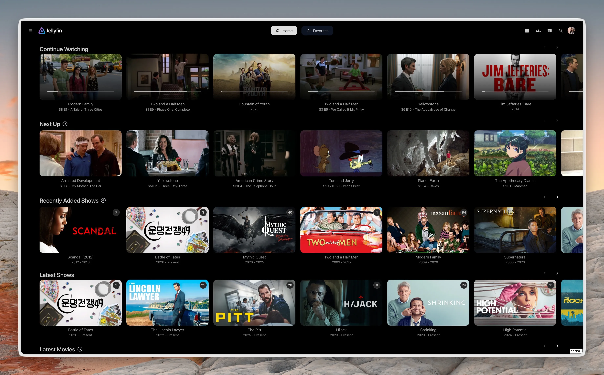
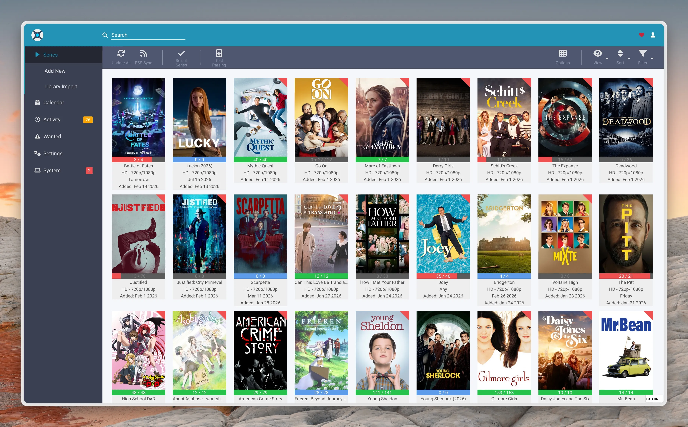
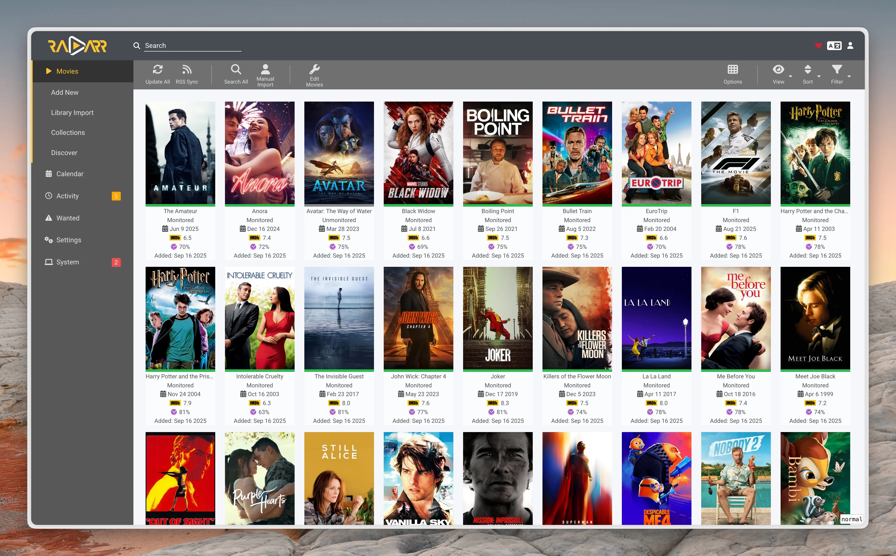
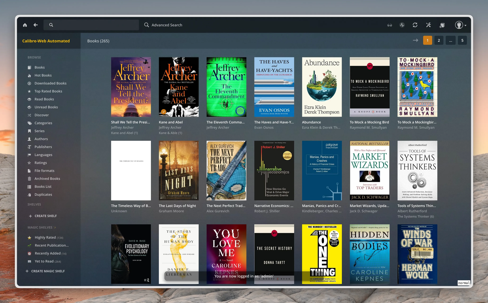
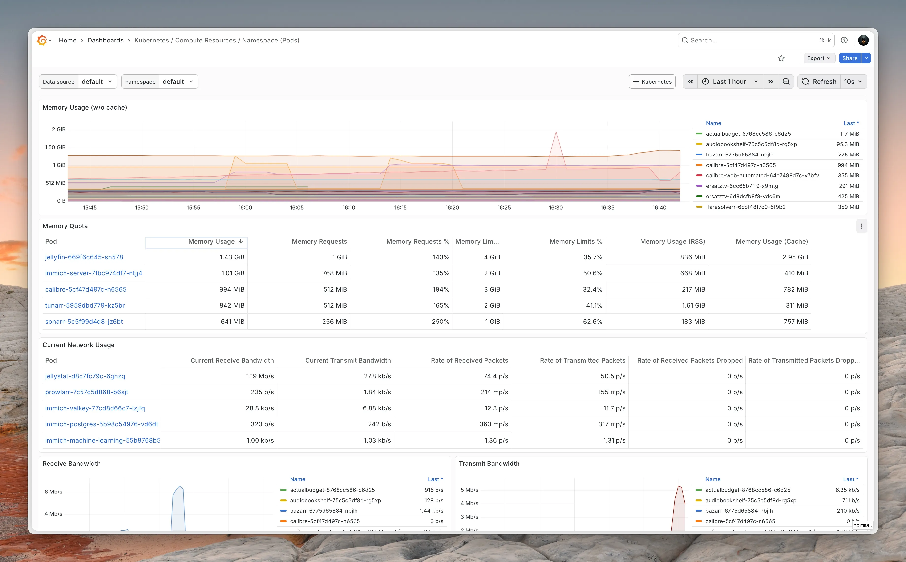
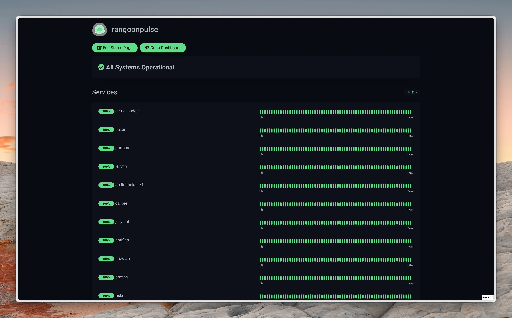
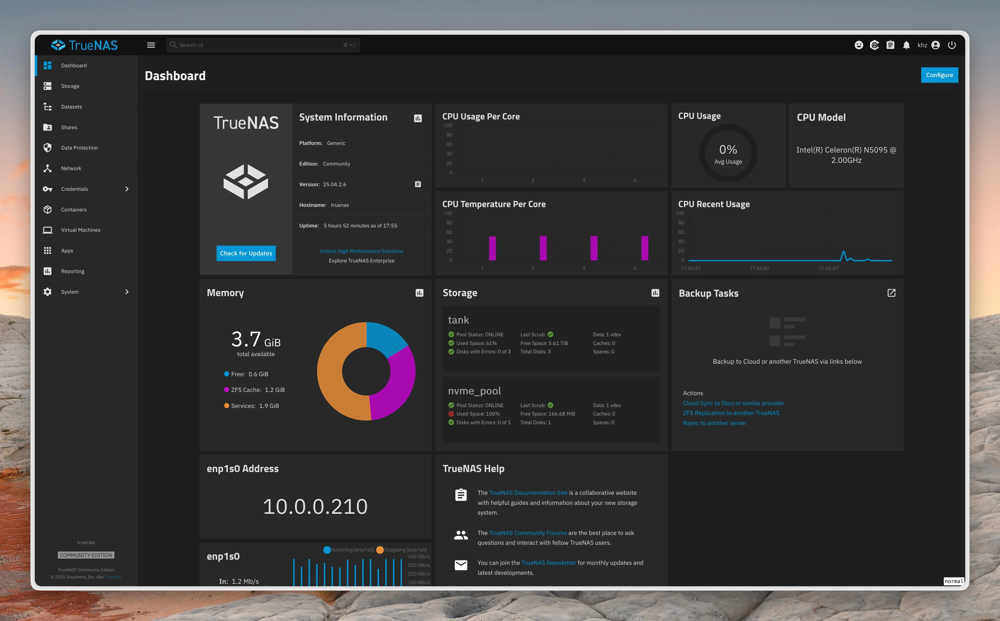

# ⛵ rangoonpulse

[](https://kubernetes.io/)
[](https://talos.dev/)
[](https://fluxcd.io/)
[]()
[]()

> Infrastructure-as-code for my homelab Kubernetes cluster, managed with **Flux CD GitOps**.

```
┌─────────────────────────────────────────────────────────────────────────────┐
│                         🏠 Rangoon Pulse Homelab                            │
├─────────────────────────────────────────────────────────────────────────────┤
│                                                                             │
│   ┌──────────────┐         ┌──────────────┐         ┌──────────────┐       │
│   │   🌐 LAN     │◄───────►│   ☁️ Cloud   │◄───────►│ 📱 Tailscale │       │
│   └──────────────┘         └──────────────┘         └──────────────┘       │
│          │                        │                        │               │
│          └────────────────────────┼────────────────────────┘               │
│                                   ▼                                        │
│                    ┌──────────────────────────┐                           │
│                    │   🔀 Ingress-Nginx       │                           │
│                    │   10.0.0.231 (MetalLB)   │                           │
│                    └───────────┬──────────────┘                           │
│                                │                                          │
│              ┌─────────────────┴─────────────────┐                        │
│              ▼                                   ▼                        │
│   ┌──────────────────────┐        ┌──────────────────────┐               │
│   │ 🖥️ Primary Node       │        │  🥧 Raspberry Pi      │               │
│   │ talos-7nf-osf        │        │  talos-uua-g6r        │               │
│   │ i5-8400T · 32GB ·    │        │  ARM64 · 8GB          │               │
│   │ NVMe · Intel iGPU    │        │  (Raspberry Pi)       │               │
│   └──────────────────────┘        └──────────────────────┘               │
│                                                                             │
└─────────────────────────────────────────────────────────────────────────────┘
```

---

## ✨ Highlights

| Feature | Description |
|---------|-------------|
| 🔄 **GitOps-First** | Everything reconciles via Flux — `Kustomization` + `HelmRelease` |
| 🌐 **Unified Access** | Single ingress VIP (`10.0.0.231`) for LAN + Tailscale clients |
| 💾 **Smart Storage** | NAS-backed PVCs by default; `local-path` for DBs & hot caches |
| 🤖 **Auto Tuning** | Resource Advisor CronJobs generate safe, budgeted resource PRs |
| 📍 **Node Pinning** | Userland apps pinned to primary node; ARM allowlist for Pi |
| 🔒 **SOPS Secrets** | Age-encrypted secrets, decrypted by Flux at runtime |

---

## 🖥️ Hardware

| Node | Role | Arch | Specs | IP |
|------|------|------|-------|-----|
| `talos-7nf-osf` | Control Plane + Workloads | `amd64` | i5-8400T (6c/6t) · 32GB · NVMe · Intel iGPU | `10.0.0.197` |
| `talos-uua-g6r` | Utility Workloads | `arm64` | 4 cores · 8GB (Raspberry Pi) | `10.0.0.38` |

Current cluster status: both nodes are functional and schedulable.

---

## 🏗️ Stack

### Core Infrastructure

[](https://talos.dev/)
[](https://kubernetes.io/)
[](https://fluxcd.io/)
[](https://helm.sh/)

### Networking & Ingress

[](https://nginx.org/)
[](https://metallb.org/)
[](https://cloudflare.com/)
[](https://tailscale.com/)

### Storage & Secrets

[](https://truenas.com/)
[](https://github.com/democratic-csi/democratic-csi)
[](https://github.com/getsops/sops)
[](https://age-encryption.org/)

### Observability

[](https://prometheus.io/)
[](https://grafana.com/)
[](https://uptime.kuma.pet/)

---

## 🧩 Services

### 🛡️ Core Infrastructure

| Service | Description |
|---------|-------------|
| 🛡️ **AdGuard Home** | Dual LAN DNS filtering & ad blocking |
| 🧭 **Glance** | Dashboard & service hub |
| ⏱️ **Uptime Kuma** | Uptime monitoring |
| 📈 **Grafana** | Metrics & dashboards |
| ⚡ **Speedtest** | Network speed testing |
| 🧮 **Resource Advisor** | Automated resource tuning |

### 🎬 Media & Library

| Service | Description |
|---------|-------------|
| 🎬 **Jellyfin** | Media server with Intel iGPU transcoding |
| 📸 **Immich** | Photo & video backup |
| 🎟️ **Seerr** | Media request manager |
| 🎧 **Audiobookshelf** | Audiobook & podcast server |
| 📚 **Calibre** | E-book library management |

### 🤖 Media Automation

```
┌─────────────┐    ┌─────────────┐    ┌─────────────┐
│   autobrr   │───►│  profilarr  │───►│  prowlarr   │
└─────────────┘    └─────────────┘    └──────┬──────┘
                                             │
         ┌──────────┬──────────┬─────────────┼──────────┐
         ▼          ▼          ▼             ▼          ▼
    ┌─────────┐ ┌─────────┐ ┌─────────┐ ┌─────────┐ ┌─────────┐
    │  sonarr │ │  radarr │ │  bazarr │ │ sabnzbd │ │transmission
    └─────────┘ └─────────┘ └─────────┘ └─────────┘ └─────────┘
```

*Plus: tracerr for tracking automation metrics*

### 📺 Live TV & Tools

| Service | Description |
|---------|-------------|
| 📺 **nodecast-tv** | Live TV streaming |
| 🧩 **iSponsorBlockTV** | SponsorBlock for TV clients |
| 🎞️ **Tunarr** | Channel scheduling |
| 📼 **ErsatzTV** | Custom TV channels |

### 💼 Productivity

| Service | Description |
|---------|-------------|
| 💸 **Actual Budget** | Personal finance tracking |
| 🔐 **Vaultwarden** | Password manager |
| 📊 **ChartDB** | Database schema diagrams |
| 📝 **Obsidian LiveSync** | Note sync via CouchDB |
| 🎴 **Anki Server** | Flashcard sync |
| 📖 **BookLore** | E-book reader & manager |

---

## 📁 Repository Structure

```
.
├── 📂 apps/                    # User-facing applications
│   ├── jellyfin/
│   ├── immich/
│   ├── glance/
│   └── ...
├── 📂 core/                    # Core cluster components
│   └── ingress-nginx/
├── 📂 infrastructure/          # Infrastructure services
│   ├── cert-manager/
│   ├── external-dns/
│   ├── metallb/
│   ├── monitoring/
│   ├── resource-advisor/
│   ├── secrets/
│   ├── storage/
│   └── tailscale-operator/
├── 📂 flux/                    # Flux GitOps configuration
│   ├── repositories/           # Helm repositories
│   └── kustomizations/         # App kustomizations
├── 📂 talos/                   # Talos machine configuration
├── 📂 docs/                    # Documentation & runbooks
└── 📂 scripts/                 # Operational scripts
```

---

## 🚀 Quick Start

### Prerequisites

- [kubectl](https://kubernetes.io/docs/tasks/tools/)
- [flux](https://fluxcd.io/docs/installation/)
- [talosctl](https://www.talos.dev/v1.8/talos-guides/install/talosctl/)

### Useful Commands

```bash
# Check Flux health
flux get kustomizations
flux get hr -A

# Reconcile a component
flux reconcile kustomization <name> --with-source

# Cluster triage
kubectl get pods -A
kubectl get events -A --sort-by=.lastTimestamp | tail -n 50
kubectl top nodes
kubectl top pods -A

# Talos node dashboard
talosctl -n 10.0.0.197 dashboard
```

### Static Sites (`blog`, `mmcal`)

```bash
# Normal mode:
# 1) push in source repo (blog/mmcal)
# 2) image gets published
# 3) Flux image automation updates this repo on interval (6h)

# Fast path (deploy now)
make deploy-blog
make deploy-mmcal
```

- `make deploy-*` forces image repository scan, image policy resolution, image update automation, source reconcile, and app kustomization reconcile.
- Cloudflare cache policy should bypass HTML/update-critical routes (`/`, `index.html`, service worker/manifest/feed paths) and cache static assets aggressively.

> 📚 [Full ops cheatsheet →](docs/ops-command-cheatsheet.md)

---

## ⚠️ Operational Notes

> [!WARNING]
> **NFS PVCs failing?** Check that the TrueNAS Tailscale app has **"Accept Routes" disabled** to avoid asymmetric routing issues.
>
> See: [`docs/truenas-tailscale-accept-routes-caused-democratic-csi-outage.md`](docs/truenas-tailscale-accept-routes-caused-democratic-csi-outage.md)

---

## 📸 Screenshots

### 🧭 Dashboard





---

### 🎬 Jellyfin




---

### Sonarr & Radarr





---

### Calibre




---

### 📊 Monitoring Stack

**Grafana**



**Uptime Kuma**



---

### 🗄️ TrueNAS Storage



---

## 📜 Documentation

| Doc | Description |
|-----|-------------|
| [`ops-command-cheatsheet.md`](docs/ops-command-cheatsheet.md) | Full command reference |
| [`adguard-dns-stack-overview.md`](docs/adguard-dns-stack-overview.md) | Dual AdGuard DNS architecture |
| [`resource-advisor-phase1-phase2.md`](docs/resource-advisor-phase1-phase2.md) | Resource tuning automation |
| [`networking-current-state-and-simplification.md`](docs/networking-current-state-and-simplification.md) | Network design |
| [`secrets-inventory.md`](docs/secrets-inventory.md) | Secrets reference |
| [`backup-plan.md`](docs/backup-plan.md) | Backup strategy |

---

## 🏠 Domains

| Domain | Purpose |
|--------|---------|
| `khzaw.dev` | Primary domain for all services |
| `*.khzaw.dev` | Service subdomains via external-dns |
