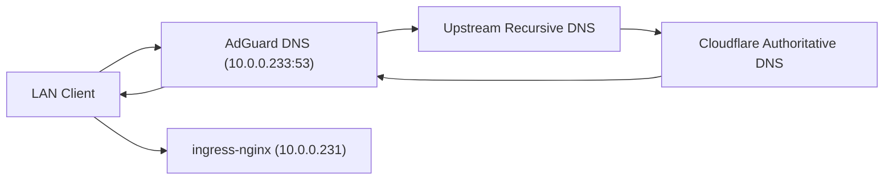

# AdGuard DNS Stack: Router Setup and Architecture

## Purpose
This document explains:
- how AdGuard is exposed in this cluster,
- what DNS IP to configure on the router, and
- how AdGuard changes the overall DNS stack without changing GitOps DNS ownership.

## Current Deployment (As Of 2026-02-18)
- HelmRelease: `apps/adguard/helmrelease.yaml`
- Namespace: `default`
- DNS Service: `Service/adguard-dns`
  - type: `LoadBalancer`
  - IP: `10.0.0.233`
  - ports: TCP/UDP `53`
- Web UI Service: `Service/adguard-main`
  - type: `ClusterIP`
  - web port: `80`
- Web UI ingress:
  - hostname: `adguard.khzaw.dev`
  - ingress VIP: `10.0.0.231`

## Router Configuration (What To Enter)
Use this LAN DNS server in router DHCP/DNS settings:
- `10.0.0.233`

Do not use:
- Kubernetes `ClusterIP` addresses (for example `10.109.x.x`), since they are cluster-internal only.

Recommended router DNS policy:
- Primary DNS: `10.0.0.233`
- Secondary DNS:
  - leave empty, or
  - set to another AdGuard instance (if you have one).

Avoid using public DNS as secondary (for example `1.1.1.1`, `8.8.8.8`) if you want consistent filtering, because many
clients will bypass AdGuard when a secondary resolver is present.

## How This Changes The DNS Stack
AdGuard changes recursive resolution for LAN clients; it does not replace authoritative DNS automation.

What stays the same:
- `external-dns` still manages Cloudflare records.
- App hostnames still resolve to ingress VIP `10.0.0.231`.
- cert-manager + ingress-nginx TLS flow is unchanged.

What changes:
- LAN clients query AdGuard (`10.0.0.233`) first.
- AdGuard applies filtering/policies and forwards to upstream resolvers.



## Operational Gotchas

### 1) AdGuard Wizard Can Change Web Port
After setup, AdGuard may switch web UI from `:3000` to `:80`.

If Kubernetes Service/Ingress still targets `3000`, `https://adguard.khzaw.dev` returns `502` from nginx.

Expected GitOps state:
- `apps/adguard/helmrelease.yaml` -> `service.main.ports.http.port: 80`

### 2) Runtime Config Drift vs GitOps
AdGuard writes runtime config into `/opt/adguardhome/conf/AdGuardHome.yaml` on the PVC. UI changes and setup wizard actions can
drift away from intended GitOps behavior.

To keep performance behavior stable, startup now enforces these keys in
`apps/adguard/helmrelease.yaml` before launching AdGuard:
- `dns.upstream_mode: fastest_addr`
- `dns.fastest_timeout: 1s`
- `dns.cache_size: 16777216`
- `dns.cache_ttl_min: 60`
- `dns.cache_ttl_max: 3600`
- `dns.cache_optimistic: true`
- `dns.upstream_timeout: 3s`
- `http.address: 0.0.0.0:80`

This keeps DNS latency optimization and web UI port alignment consistent after restarts.

### 3) Router DNS Rebind Protection
If DNS answers point public hostnames to private IPs (for example `10.0.0.231`), some routers block replies.

See:
- `docs/router-dns-rebind-private-a-records.md`

## Validation Commands
```bash
# Check AdGuard DNS service exposure
kubectl get svc -n default adguard-dns -o wide

# Check web service and ingress backend port
kubectl get svc -n default adguard-main -o wide
kubectl describe ingress -n default adguard

# DNS resolution through AdGuard
dig @10.0.0.233 hq.khzaw.dev +short
dig @10.0.0.233 google.com +short

# App health
flux get hr -n default adguard
kubectl logs -n default deploy/adguard --tail=100
```
