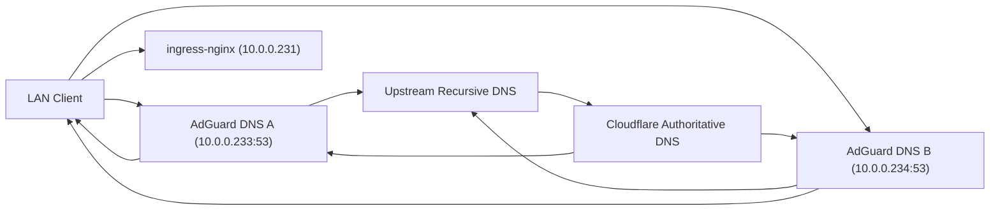

# AdGuard DNS Stack: Router Setup and Architecture

## Purpose
This document explains:
- how AdGuard is exposed in this cluster,
- what DNS IP to configure on the router, and
- how AdGuard changes the overall DNS stack without changing GitOps DNS ownership.

## Current Deployment (As Of 2026-03-08)
- Namespace: `default`
- Primary HelmRelease: `apps/adguard/helmrelease.yaml`
  - node: `talos-uua-g6r`
  - DNS Service: `Service/adguard-dns`
    - type: `LoadBalancer`
    - IP: `10.0.0.233`
    - `externalTrafficPolicy: Local` (preserve source IPs for AdGuard query logs)
    - ports: TCP/UDP `53`
  - Web UI Service: `Service/adguard-main`
    - type: `ClusterIP`
    - web port: `80`
  - Web UI ingress:
    - hostname: `adguard.khzaw.dev`
    - ingress VIP: `10.0.0.231`
- Secondary HelmRelease: `apps/adguard/helmrelease-secondary.yaml`
  - node: `talos-7nf-osf`
  - DNS Service: `Service/adguard-secondary-dns`
    - type: `LoadBalancer`
    - IP: `10.0.0.234`
    - `externalTrafficPolicy: Local`
    - ports: TCP/UDP `53`
  - Web UI Service: `Service/adguard-secondary-main`
    - type: `ClusterIP`
    - web port: `80`
  - Web UI ingress:
    - hostname: `adguard2.khzaw.dev`
    - ingress VIP: `10.0.0.231`

## Router Configuration (What To Enter)
Use this LAN DNS server in router DHCP/DNS settings:
- Primary DNS: `10.0.0.233`
- Secondary DNS: `10.0.0.234`

Do not use:
- Kubernetes `ClusterIP` addresses (for example `10.109.x.x`), since they are cluster-internal only.

Recommended DNS policy:
- Primary DNS: `10.0.0.233`
- Secondary DNS: `10.0.0.234`

Avoid using public DNS as secondary (for example `1.1.1.1`, `8.8.8.8`) if you want consistent filtering, because many
clients will bypass AdGuard when a secondary resolver is present.

## How This Changes The DNS Stack
AdGuard changes recursive resolution for LAN clients; it does not replace authoritative DNS automation.

What stays the same:
- `external-dns` still manages Cloudflare records.
- App hostnames still resolve to ingress VIP `10.0.0.231`.
- cert-manager + ingress-nginx TLS flow is unchanged.

What changes:
- LAN clients query the AdGuard pair (`10.0.0.233`, `10.0.0.234`) from router DHCP/DNS settings.
- AdGuard applies filtering/policies and forwards to upstream resolvers.


```mermaid
flowchart LR
  C["LAN Client"] --> A["AdGuard DNS A (10.0.0.233:53)"]
  C --> B["AdGuard DNS B (10.0.0.234:53)"]
  A --> U["Upstream Recursive DNS"]
  B --> U
  U --> F["Cloudflare Authoritative DNS"]
  F --> A
  F --> B
  A --> C
  B --> C
  C --> I["ingress-nginx (10.0.0.231)"]
```

## Operational Gotchas

### 1) AdGuard Wizard Can Change Web Port
After setup, AdGuard may switch web UI from `:3000` to `:80`.

If Kubernetes Service/Ingress still targets `3000`, `https://adguard.khzaw.dev` returns `502` from nginx.

Expected GitOps state:
- `apps/adguard/helmrelease.yaml` -> `service.main.ports.http.port: 80`

### 2) Runtime Config Drift vs GitOps
AdGuard writes runtime config into `/adguard-data/conf/AdGuardHome.yaml` on the PVC. UI changes and setup wizard actions can
drift away from intended GitOps behavior.

To keep behavior stable, startup now enforces DNS keys in
`apps/adguard/helmrelease.yaml` and `apps/adguard/helmrelease-secondary.yaml` before launching AdGuard:
- `dns.upstream_mode: fastest_addr`
- `dns.fastest_timeout: 1s`
- `dns.cache_size: 16777216`
- `dns.cache_ttl_min: 60`
- `dns.cache_ttl_max: 3600`
- `dns.cache_optimistic: true`
- `dns.upstream_timeout: 3s`
- `http.address: 0.0.0.0:80`
- `dhcp.enabled: false` (router remains DHCP authority)

### 3) Do Not Store AdGuard State Behind `subPath` Mounts
AdGuard writes both runtime config and state into its data directory. In this cluster, mounting the PVC once at a neutral path
(`/adguard-data`) is safer than splitting `conf/` and `work/` behind separate `subPath` mounts.

Why this matters:
- a bad `subPath` mount can let AdGuard silently write into container overlay storage instead of the PVC,
- the app can appear healthy until the pod is recreated,
- after a reboot/reschedule, AdGuard comes back as a first-run install on `:3000`, and ingress still returns `502`.

Expected GitOps state:
- both AdGuard HelmReleases mount their PVC at `/adguard-data`
- container startup refuses to continue unless `/adguard-data` is an actual mounted volume

### 4) Do Not Make Two Active AdGuard Pods Share One Writable State Directory
Two active AdGuard instances should not share the same writable PVC for `conf/` and `work/`.

Why this matters:
- AdGuard stores runtime config, sessions, logs, and statistics in its data directory.
- Running two pods against one writable state tree risks conflicting writes and corrupt state.
- HA DNS should use separate PVCs per instance.

Safe pattern in this cluster:
- one PVC per AdGuard instance,
- same GitOps-enforced baseline runtime tuning on both instances,
- if you want matching behavior, copy `AdGuardHome.yaml` from the primary instance to the secondary instance as a one-way sync.

### 5) Router DNS Rebind Protection
If DNS answers point public hostnames to private IPs (for example `10.0.0.231`), some routers block replies.

See:
- `docs/router-dns-rebind-private-a-records.md`

### 6) Seeing Real Client IPs In AdGuard Query Log
If AdGuard query logs show only a Kubernetes node IP, source NAT is happening before traffic reaches the pod.

Expected GitOps state:
- `apps/adguard/helmrelease.yaml` and `apps/adguard/helmrelease-secondary.yaml` -> `service.dns.externalTrafficPolicy: Local`

Important:
- If all queries still appear as one IP after this change, that IP is usually the router (DNS proxy/relay mode).
- For per-device visibility, clients must query AdGuard directly (`10.0.0.233`) via DHCP or local DNS settings, not via router DNS forwarding.

## Validation Commands
```bash
# Check AdGuard DNS service exposure
kubectl get svc -n default adguard-dns -o wide
kubectl get svc -n default adguard-secondary-dns -o wide
kubectl get svc -n default adguard-dns -o jsonpath='{.spec.externalTrafficPolicy}{"\n"}'
kubectl get svc -n default adguard-secondary-dns -o jsonpath='{.spec.externalTrafficPolicy}{"\n"}'

# Check web service and ingress backend port
kubectl get svc -n default adguard-main -o wide
kubectl get svc -n default adguard-secondary-main -o wide
kubectl describe ingress -n default adguard
kubectl describe ingress -n default adguard-secondary

# DNS resolution through AdGuard
dig @10.0.0.233 hq.khzaw.dev +short
dig @10.0.0.234 hq.khzaw.dev +short
dig @10.0.0.233 google.com +short
dig @10.0.0.234 google.com +short

# App health
flux get hr -n default adguard
flux get hr -n default adguard-secondary
kubectl logs -n default deploy/adguard --tail=100
kubectl logs -n default deploy/adguard-secondary --tail=100
```
