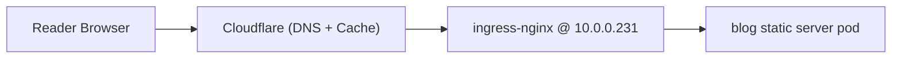

# Blog Deployment Plan: Static Site + GitOps + Low-Cost HN Resilience

## Purpose
This document defines a practical deployment architecture for a static blog (Hugo assumed) that:
- deploys automatically on Git push,
- runs on the homelab Kubernetes cluster,
- exposes only `blog.khzaw.dev` publicly,
- keeps other app subdomains tailnet-only,
- remains cost-conscious and resilient to traffic spikes.

## Desired Outcome
- Source content and theme live in a separate `blog` GitHub repository.
- Deployment to Kubernetes is automated and GitOps-aligned.
- Blog is reachable at `https://blog.khzaw.dev` publicly.
- Other services remain private via Tailscale access pattern.

## High-Level Architecture

### Repositories and Responsibilities
1. `blog` repository
- Hugo source, content, theme, static assets.
- GitHub Actions builds and publishes a container image.

2. `rangoonpulse` repository
- Kubernetes manifests and Flux resources.
- Declares how blog image is deployed.
- Flux automates updates when new blog image is published.

### End-to-End Publish Flow
1. Author pushes to `blog` repo.
2. GitHub Actions in `blog` repo builds site (`hugo --minify`).
3. Action packages static output in a small web image (`nginx` or `caddy`).
4. Action pushes image to GHCR with immutable metadata.
5. Flux image automation in cluster detects new image.
6. Flux updates image reference in `rangoonpulse` manifest (Git commit).
7. Flux reconciles and rolls out updated pod.
8. `blog.khzaw.dev` serves the new version.

### Request Path (Runtime)

## Public vs Private Routing Policy

### Public
- `blog.khzaw.dev`
- Public DNS and ingress routing enabled.
- TLS via cert-manager (`letsencrypt-prod`).

### Private
- Existing app subdomains remain tailnet-only.
- Do not create public tunnel/public route mappings for private app hosts.
- Preserve current LAN + tailnet access model for non-blog services.

## Why This Fits GitOps
- CI builds artifacts only (container image generation).
- Flux remains the deploy authority for Kubernetes state.
- Deployment history remains in Git via Flux image automation commits.
- Rollback can be done by reverting image tag/digest in Git.

## HN Hug-of-Death Strategy (Low Cost)

### Baseline Controls (Recommended)
1. Cloudflare proxied DNS for `blog.khzaw.dev`.
2. Cache rules:
- Cache Everything for HTML (with conservative TTL if frequent edits).
- Long TTL for hashed CSS/JS/image assets.
3. Enable Tiered Cache.

Result:
- Most requests terminate at edge cache.
- Home uplink and cluster origin receive far fewer requests.

### Operational Note
- A homelab origin is still a single-origin bottleneck during cold-cache spikes.
- Edge caching significantly improves survivability, but not infinitely.

## Image and Media Strategy

### Option A: Build-Time Optimization (Default)
- Use Hugo image processing (resize/compress/format conversion).
- Prefer `webp`/`avif` variants where practical.
- Ship optimized static files only.

Pros:
- No extra infrastructure.
- Minimal runtime cost.

### Option B: Offload Media to Cloudflare R2 (Recommended if image-heavy)
- Serve images from `img.khzaw.dev` backed by R2.
- Keep blog HTML origin in cluster.

Pros:
- Reduces origin bandwidth pressure.
- Very low cost profile.

### Option C: On-the-fly transforms (later)
- Use Cloudflare image transformations for dynamic variants.
- Useful if article image variant needs become complex.

## Kubernetes Deployment Shape

### Suggested App Layout in `rangoonpulse`
- `apps/blog/helmrelease.yaml` (or `infrastructure/blog` if preferred by categorization)
- `apps/blog/kustomization.yaml`
- `flux/kustomizations/blog.yaml`

### HelmRelease Characteristics
- Chart: `bjw-s` app-template.
- Container: `ghcr.io/<owner>/<blog-image>:<tag-or-digest>`.
- Resources: lightweight static serving defaults.
- Service: ClusterIP.
- Ingress host: `blog.khzaw.dev`.
- TLS secret: `blog-tls` with cert-manager issuer `letsencrypt-prod`.
- External-DNS annotation for `blog.khzaw.dev`.

### Flux Image Automation Resources
- `ImageRepository`: points to GHCR blog image.
- `ImagePolicy`: picks latest stable strategy.
- `ImageUpdateAutomation`: writes updates into `rangoonpulse` Git.

## CI Workflow in Blog Repository

### Trigger
- Push to `main` (and optional manual dispatch).

### Steps
1. Checkout repository.
2. Setup Hugo extended.
3. Build site (`hugo --minify`).
4. Build runtime image containing `public/`.
5. Push image to GHCR.
6. Optionally publish a signed provenance/attestation.

## Rollback Strategy
1. Revert image update commit in `rangoonpulse`.
2. Flux reconciles previous image.
3. Verify `blog.khzaw.dev` response and content health.

No data-plane rollback complexity exists for static content beyond image/version change.

## Verification Checklist
1. `blog.khzaw.dev` resolves publicly.
2. TLS is valid and trusted.
3. Non-blog apps are still tailnet-only.
4. Push test commit to `blog` repo updates live site automatically.
5. Cloudflare cache headers and hit ratio behave as expected.

## Cost Profile
- Cluster hosting: existing sunk cost (homelab).
- CI: GitHub Actions free tier typically sufficient for moderate publishing cadence.
- CDN/cache: Cloudflare free-tier features cover initial needs.
- Optional media offload (R2): low-cost incremental usage.

## Agreed Direction
Proceed with this two-repo GitOps model:
1. Blog source/build in `blog` repo.
2. Flux-managed deployment in `rangoonpulse`.
3. Public exposure only for `blog.khzaw.dev`.
4. Add Cloudflare caching policy from day one.
5. Consider R2 for media if article/photo traffic grows.
