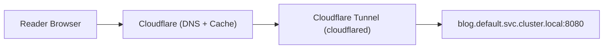

# Blog Deployment Plan: Static Site + GitOps + Low-Cost HN Resilience

## Purpose
This document defines a practical deployment architecture for a static blog (Hugo assumed) that:
- deploys automatically on Git push,
- runs on the homelab Kubernetes cluster,
- exposes `khzaw.dev` and `blog.khzaw.dev` publicly,
- redirects `www.khzaw.dev` to `khzaw.dev`,
- keeps other app subdomains tailnet-only,
- remains cost-conscious and resilient to traffic spikes.

## Desired Outcome
- Source content and theme live in a separate `blog` GitHub repository.
- Deployment to Kubernetes is automated and GitOps-aligned.
- Blog is reachable at `https://khzaw.dev` and `https://blog.khzaw.dev` publicly.
- `https://www.khzaw.dev` redirects permanently to `https://khzaw.dev`.
- Other services remain private via Tailscale access pattern.

## High-Level Architecture

### Repositories and Responsibilities
1. `blog` repository
- Hugo source, content, theme, static assets.
- GitHub Actions builds and publishes a container image.

2. `rangoonpulse` repository
- Kubernetes manifests and Flux resources.
- Declares how blog image is deployed.
- Flux automates updates when new blog image is published.

### End-to-End Publish Flow
1. Author pushes to `blog` repo.
2. GitHub Actions in `blog` repo builds site (`hugo --minify`).
3. Action packages static output in a small web image (`static-web-server`).
4. Action pushes image to GHCR with immutable metadata.
5. Flux image automation in cluster detects new image on interval (`6h`).
6. Flux updates image reference in `rangoonpulse` manifest (Git commit).
7. Flux reconciles and rolls out updated pod.
8. `khzaw.dev` and `blog.khzaw.dev` serve the new version.
9. Workflow optionally purges Cloudflare update-critical URLs if cache purge secrets are configured.

### Request Path (Runtime)

```mermaid
flowchart LR
  A["Reader Browser"] --> B["Cloudflare (DNS + Cache)"]
  B --> C["Cloudflare Tunnel (cloudflared)"]
  C --> D["blog.default.svc.cluster.local:8080"]
```

## Public vs Private Routing Policy

### Public
- `khzaw.dev`
- `blog.khzaw.dev`
- `www.khzaw.dev` redirects to `khzaw.dev`
- Public DNS points at Cloudflare Tunnel for internet reachability.
- `blog.khzaw.dev` is a DNS alias to `khzaw.dev`; this does not itself redirect the browser URL.
- `www.khzaw.dev` is also a DNS alias to `khzaw.dev`; the browser URL changes only because a Cloudflare Redirect Rule handles the HTTP redirect.
- Private ingress remains on `blog.khzaw.dev` for LAN/Tailscale access.

### Private
- Existing app subdomains remain tailnet-only.
- Do not create public tunnel/public route mappings for private app hosts.
- Preserve current LAN + tailnet access model for non-blog services.

## Why This Fits GitOps
- CI builds artifacts only (container image generation).
- Flux remains the deploy authority for Kubernetes state.
- Deployment history remains in Git via Flux image automation commits.
- Rollback can be done by reverting image tag/digest in Git.

## HN Hug-of-Death Strategy (Low Cost)

### Baseline Controls (Recommended)
1. Cloudflare proxied DNS for `khzaw.dev`, `blog.khzaw.dev`, and `www.khzaw.dev`.
2. Cache rules:
- Bypass cache for update-critical HTML/routes (`/`, `index.html`, feed/sitemap paths, other `.html` pages).
- Long TTL for hashed CSS/JS/image assets.
3. Enable Tiered Cache.

Result:
- Most requests terminate at edge cache.
- Home uplink and cluster origin receive far fewer requests.

### Operational Note
- A homelab origin is still a single-origin bottleneck during cold-cache spikes.
- Edge caching significantly improves survivability, but not infinitely.

## Image and Media Strategy

### Option A: Build-Time Optimization (Default)
- Use Hugo image processing (resize/compress/format conversion).
- Prefer `webp`/`avif` variants where practical.
- Ship optimized static files only.

Pros:
- No extra infrastructure.
- Minimal runtime cost.

### Option B: Offload Media to Cloudflare R2 (Recommended if image-heavy)
- Serve images from `img.khzaw.dev` backed by R2.
- Keep blog HTML origin in cluster.

Pros:
- Reduces origin bandwidth pressure.
- Very low cost profile.

### Option C: On-the-fly transforms (later)
- Use Cloudflare image transformations for dynamic variants.
- Useful if article image variant needs become complex.

## Kubernetes Deployment Shape

### Suggested App Layout in `rangoonpulse`
- `apps/blog/helmrelease.yaml` (or `infrastructure/blog` if preferred by categorization)
- `apps/blog/kustomization.yaml`
- `flux/kustomizations/blog.yaml`

### HelmRelease Characteristics
- Chart: `bjw-s` app-template.
- Container: `ghcr.io/<owner>/<blog-image>:<tag-or-digest>`.
- Resources: lightweight static serving defaults.
- Service: ClusterIP.
- Ingress host: `blog.khzaw.dev` for the private/LAN path only.
- TLS secret: `blog-tls` with cert-manager issuer `letsencrypt-prod`.
- Do not attach public apex/blog external-dns annotations to the Ingress; public DNS is owned by `infrastructure/public-edge/share-hosts-cname.yaml`.
- Keep the cloudflared hostname route for `blog.khzaw.dev` even when public DNS aliases it to `khzaw.dev`, because requests still arrive with `Host: blog.khzaw.dev`.
- Keep `www.khzaw.dev` redirect-only at Cloudflare edge. Do not add it to the blog Ingress or cloudflared origin routes unless the redirect is intentionally moved into the cluster.

### Flux Image Automation Resources
- `ImageRepository`: points to GHCR blog image.
- `ImagePolicy`: picks latest stable strategy.
- `ImageUpdateAutomation`: writes updates into `rangoonpulse` Git.

## CI Workflow in Blog Repository

### Trigger
- Push to `master` (and optional manual dispatch).

### Steps
1. Checkout repository.
2. Setup Hugo extended.
3. Build site (`hugo --minify`).
4. Build runtime image containing `public/`.
5. Push image to GHCR.
6. Optionally publish a signed provenance/attestation.

## Rollback Strategy
1. Revert image update commit in `rangoonpulse`.
2. Flux reconciles previous image.
3. Verify `khzaw.dev` and `blog.khzaw.dev` response and content health.

No data-plane rollback complexity exists for static content beyond image/version change.

## Verification Checklist
1. `khzaw.dev` resolves publicly.
2. `blog.khzaw.dev` resolves publicly.
3. `www.khzaw.dev` resolves publicly and returns `301` to `https://khzaw.dev`.
4. TLS is valid and trusted.
5. Non-blog apps are still tailnet-only.
6. Push test commit to `blog` repo updates live site automatically.
7. Cloudflare cache headers and hit ratio behave as expected.

## Cost Profile
- Cluster hosting: existing sunk cost (homelab).
- CI: GitHub Actions free tier typically sufficient for moderate publishing cadence.
- CDN/cache: Cloudflare free-tier features cover initial needs.
- Optional media offload (R2): low-cost incremental usage.

## Agreed Direction
Proceed with this two-repo GitOps model:
1. Blog source/build in `blog` repo.
2. Flux-managed deployment in `rangoonpulse`.
3. Public exposure only for `khzaw.dev` and `blog.khzaw.dev`, with `www.khzaw.dev` redirecting to the apex.
4. Add Cloudflare caching policy from day one.
5. Consider R2 for media if article/photo traffic grows.

## Related Static Sites
- `mmcal.${BASE_DOMAIN}` and `rangoonmapper.${BASE_DOMAIN}` follow the same source-repo image publish plus Flux image automation pattern.
- `${ERICAKNIGHT_DOMAIN}` follows the same GitOps deployment pattern, but uses its own Cloudflare zone and permanent public-edge tunnel routes for `${ERICAKNIGHT_DOMAIN}` and `www.${ERICAKNIGHT_DOMAIN}` instead of `${BASE_DOMAIN}` subdomains. DNS for this zone is owned by `external-dns` through `infrastructure/public-edge/share-hosts-cname.yaml`.
- Pages CMS edits `github.com/khzaw/ericaknight` directly. Simple publishing means Pages CMS commits to `master`, GitHub Actions publishes `ghcr.io/khzaw/ericaknight`, and Flux image automation promotes that image into the cluster.

## Fast Manual Promotion

`controlpanel.khzaw.dev/#deploy` provides one-click Flux image-automation reconciliation for the self-built static-site targets: `blog`, `mmcal`, `ericaknight`, `itvp`, and `rangoon-mapper`. Each site button runs only that site's image automation. The global **Deploy all** button runs the same targeted flow for every static site in sequence. Use it after the source repository push has finished publishing the new GHCR image and waiting for the normal registry scan/write cadence is inconvenient.

The buttons perform the same control-plane sequence as the `make deploy-*` targets: reconcile the `ImageRepository`, resolve the `ImagePolicy`, run the per-site `ImageUpdateAutomation`, refresh `GitRepository/flux-system`, and reconcile the app `Kustomization`.
