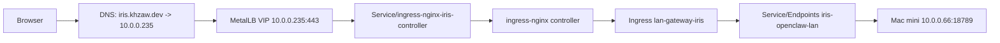
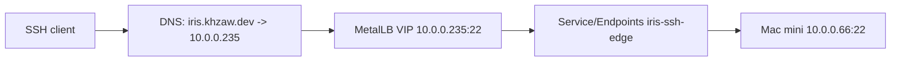

# Iris Dedicated VIP

## Purpose

Document the dedicated-VIP exception for `iris.khzaw.dev`.

Unlike ordinary private app hostnames in this cluster, `iris.khzaw.dev` must support both:

- `https://iris.khzaw.dev` for the OpenClaw Control UI
- `ssh iris@iris.khzaw.dev` for direct host management

That requirement means `iris.khzaw.dev` cannot share the ordinary ingress VIP with every other hostname, because SSH
does not route by HTTP host headers.

## Current Model

- Dedicated VIP: `10.0.0.235`
- Backend host: Mac mini `10.0.0.66`
- OpenClaw UI backend: `10.0.0.66:18789`
- SSH backend: `10.0.0.66:22`

GitOps source of truth:

- `infrastructure/iris-edge/`
- `flux/kustomizations/iris-edge.yaml`
- `infrastructure/tailscale-subnet-router/connector.yaml`
- `flux/cluster-settings.yaml`

## Traffic Layout

### Web

### SSH

## Why This Is An Exception

Most private hostnames in this cluster resolve to the shared ingress VIP `10.0.0.231` and rely on hostname-based HTTP
routing. That works for web traffic only.

`iris.khzaw.dev` is different because:

- the same hostname must terminate HTTPS and SSH,
- SSH needs a unique destination IP on port `22`,
- remote Tailscale clients still need the same destination IP as LAN clients.

The dedicated VIP avoids per-client SSH config while preserving the normal browser hostname.

## DNS Ownership

DNS for `iris.khzaw.dev` is intentionally owned by the dedicated LoadBalancer Service:

- `Service/ingress-nginx-iris-controller` carries the `external-dns` hostname annotation

The `Ingress/lan-gateway-iris` does **not** carry an `external-dns` hostname annotation. That prevents a conflicting
record target back to the shared ingress VIP.

## Tailscale

Remote tailnet clients reach `iris.khzaw.dev` through subnet routing to the dedicated VIP:

- `10.0.0.235/32` is advertised by `Connector/homelab-subnet-router`

This keeps the outside-Tailscale and inside-LAN destination identical.

## OpenClaw Host Settings

The Mac mini remains a private backend. OpenClaw itself should stay in the simple backend role:

- `gateway.bind = "lan"`
- `gateway.tailscale.mode = "off"`
- `gateway.controlUi.allowedOrigins` includes `https://iris.khzaw.dev`

OpenClaw does not need to own the certificate or the public hostname edge.

## OpenClaw Authentication Model

OpenClaw on the Mac mini has more than one gate. The dedicated VIP and ingress only solve transport:

- the gateway token authenticates the Control UI session,
- device pairing still needs approval for that browser/device,
- allowed origins still gate which browser origins may connect.

In practice that means:

- entering the correct token is not sufficient if the device is still unpaired,
- `openclaw devices approve` may still be required on the Mac mini,
- `https://iris.khzaw.dev` and `http://localhost:18789` are different origins and do not share stored Control UI settings,
- direct browser access to `http://10.0.0.66:18789` is expected to fail unless that origin is explicitly added to `gateway.controlUi.allowedOrigins`.

For the current operating model, `https://iris.khzaw.dev` is the primary UI origin and local tunnel/browser origins are optional break-glass paths only.

## Proxy Behavior

Web traffic reaches OpenClaw through ingress-nginx, so the gateway sees proxied requests rather than local loopback traffic.

Operational implications:

- proxied `iris.khzaw.dev` traffic is not automatically treated as local,
- OpenClaw may log `Proxy headers detected from untrusted address` unless `gateway.trustedProxies` is configured,
- this does not break the dedicated VIP design, but it does explain why proxied browser sessions do not get any special local treatment.

`gateway.trustedProxies` is optional. Only add it if OpenClaw features actually depend on local-client detection behind ingress.

## Operational Notes

- `IRIS_MAC_MINI_IP` must stay stable; use a DHCP reservation.
- `IRIS_VIP` must stay unique in the MetalLB pool and must not overlap existing LoadBalancer Services.
- If `iris.khzaw.dev` web breaks, check:
  - DNS answer for `iris.khzaw.dev`
  - `Service/ingress-nginx-iris-controller`
  - `Ingress/lan-gateway-iris`
  - `Service/Endpoints iris-openclaw-lan`
  - Mac mini reachability on `10.0.0.66:18789`
- If SSH breaks but web works, check:
  - `Service/Endpoints iris-ssh-edge`
  - Mac mini `sshd`
  - Tailscale route advertisement for `10.0.0.235/32`
- If the OpenClaw UI loads but login does not complete, check in this order:
  - the browser origin is `https://iris.khzaw.dev`
  - the gateway token was entered for that exact origin
  - the device is approved on the Mac mini with `openclaw devices list` / `openclaw devices approve`
  - `gateway.controlUi.allowedOrigins` still contains `https://iris.khzaw.dev`
  - recent gateway logs for `token_missing`, `pairing required`, `origin not allowed`, or proxy warnings
