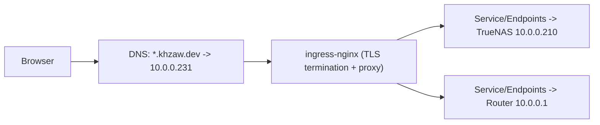

# LAN Host Access: Current State, Certificate Behavior, and Implementation Notes

## Purpose
This document explains how `nas.khzaw.dev` and `router.khzaw.dev` are exposed, why certificate errors happened
when hitting those devices directly, and the current (lean) GitOps implementation.

## Current Working State (Lean Baseline)
Both hostnames are reachable through the Kubernetes ingress path:

- `nas.khzaw.dev` resolves to ingress VIP `10.0.0.231`
- `router.khzaw.dev` resolves to ingress VIP `10.0.0.231`
- `ingress-nginx` terminates public TLS with a Let's Encrypt certificate
- Ingress routes to selectorless Services backed by static Endpoints:
  - `Service/Endpoints nas-lan -> 10.0.0.210:80`
  - `Service/Endpoints router-lan -> 10.0.0.1:80`

GitOps source of truth:
- `infrastructure/lan-gateway/nas-service.yaml`
- `infrastructure/lan-gateway/router-service.yaml`
- `infrastructure/lan-gateway/ingress.yaml`
- `infrastructure/lan-gateway/router-ingress.yaml`

### Data Path

## Why Certificate Errors Happened
The NAS and router management UIs use local certificates that are not publicly trusted for `*.khzaw.dev`.

When traffic is sent directly to those devices with their own TLS identity exposed, browsers reject the session
because of certificate trust and identity mismatch.

Common visible errors:
- self-signed certificate
- unknown issuer
- certificate name mismatch

## TrueNAS UI Notes (Websockets)
TrueNAS requires websocket upgrade on `/api/current`.

If websocket forwarding is broken, the UI can get stuck on "Connecting to TrueNAS..." and the backend may return
`400 Bad Request`.

Ingress annotations for long-lived connections are set on `infrastructure/lan-gateway/ingress.yaml`:
- `nginx.ingress.kubernetes.io/proxy-read-timeout`
- `nginx.ingress.kubernetes.io/proxy-send-timeout`

## Router UI Notes (Host + Redirects)
Some router UIs generate absolute redirects/links based on the upstream host. The router ingress includes:
- `nginx.ingress.kubernetes.io/upstream-vhost`
- `nginx.ingress.kubernetes.io/proxy-redirect-from`
- `nginx.ingress.kubernetes.io/proxy-redirect-to`

These keep the UI stable under `https://router.khzaw.dev`.

