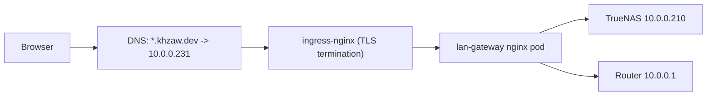
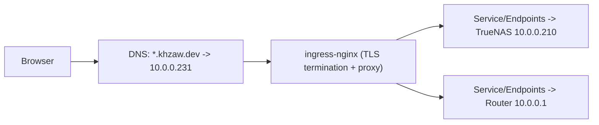

# LAN Host Access: Current State, Certificate Behavior, and Lean Migration Plan

## Purpose
This document explains the current working setup for `nas.khzaw.dev` and `router.khzaw.dev`, why certificate errors happened, how `lan-gateway` fixed them, and the leaner target design that removes the extra proxy pod.

## Current Working State
Both hostnames are reachable through the Kubernetes ingress path.

- `nas.khzaw.dev` resolves to ingress VIP `10.0.0.231`
- `router.khzaw.dev` resolves to ingress VIP `10.0.0.231`
- `ingress-nginx` terminates public TLS with a Let's Encrypt certificate
- Traffic is forwarded to `lan-gateway` (nginx) in-cluster
- `lan-gateway` reverse proxies to:
  - TrueNAS: `10.0.0.210`
  - Router: `10.0.0.1`

### Current Data Path

## Why Certificate Errors Happened
The underlying NAS and router management UIs use local certificates that are not publicly trusted for `*.khzaw.dev`.

When traffic is sent directly to those devices with their own TLS identity exposed, browsers reject the session because of certificate trust and identity mismatch.

Common visible errors:

- self-signed certificate
- unknown issuer
- certificate name mismatch

## Why TrueNAS Showed "Connecting to TrueNAS..."
TrueNAS requires websocket upgrade on `/api/current`.

Without websocket forwarding headers, the backend sees a normal HTTP GET and returns `400 Bad Request`, which causes the UI to stay on the connecting screen.

The required reverse proxy behavior is:

- `proxy_http_version 1.1`
- `Upgrade` and `Connection` headers forwarded
- long enough read and send timeouts for websocket sessions

## How `lan-gateway` Fixed It
`lan-gateway` acts as an application-aware reverse proxy between ingress and the LAN devices.

- Browser sees a valid Let's Encrypt cert at ingress
- Local self-signed backend certs are hidden from the browser
- Websocket upgrade headers are forwarded for TrueNAS
- Router UI works through the same domain path

This solved usability quickly and safely, but it introduces an extra pod and an extra proxy hop.

## Leanest Target Architecture
The lean target is to remove `lan-gateway` completely and let `ingress-nginx` proxy directly to LAN IP endpoints.

Implementation pattern:

- Create selectorless `Service` objects
- Create matching `Endpoints` pointing to `10.0.0.210` and `10.0.0.1`
- Route `nas.khzaw.dev` and `router.khzaw.dev` directly from ingress to those services
- Keep cert-manager and external-dns unchanged

### Target Data Path

## Execution Plan (Lean Migration)
1. Create `Service + Endpoints` for NAS and router in GitOps.
2. Create ingress rules for `nas.khzaw.dev` and `router.khzaw.dev` that target those services.
3. Preserve TLS via cert-manager (`letsencrypt-prod`) and existing DNS ownership via external-dns annotations.
4. Reconcile Flux and verify:
   - `https://nas.khzaw.dev` loads and TrueNAS login is usable
   - `https://router.khzaw.dev` login is usable
   - no browser certificate warnings
5. Remove `lan-gateway` HelmRelease and related resources from GitOps.
6. Reconcile again and confirm there is no regression.

## Rollback Plan
If direct ingress routing regresses:

1. Revert to the `lan-gateway` manifests/commit.
2. Reconcile Flux.
3. Verify both hostnames recover.

Rollback is quick because DNS hostnames do not need to change.
