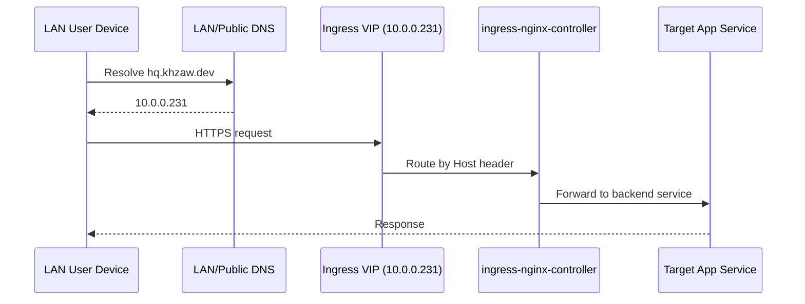
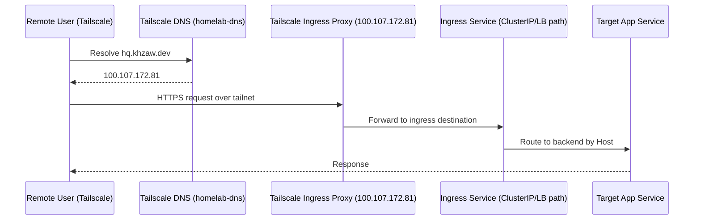
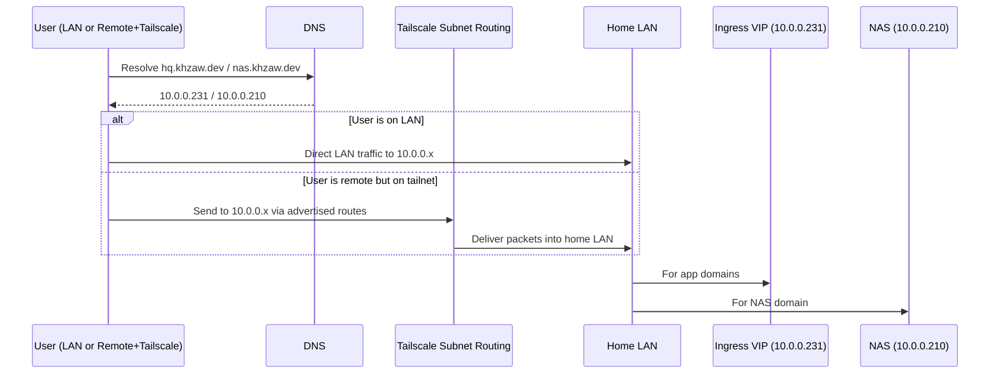

# Homelab Access Architecture: Current Setup and Simplification Strategy

## Purpose
This document explains your current working access architecture in detail and proposes a simplified target architecture that preserves your non-negotiable requirement:

- You must be able to access `*.khzaw.dev` services from inside your LAN.
- You must also be able to access the same services when outside your LAN over Tailscale.
- The same principle should extend to non-Kubernetes LAN services such as NAS (`10.0.0.210`) and router (`10.0.0.1`).

This is a learning document first. It is intentionally explicit about control plane pieces, packet flow, and DNS behavior.

## Environment Snapshot (Current, Working)
Observed from live cluster and manifests:

- Kubernetes ingress entrypoint:
  - `Service/ingress-nginx-controller` in namespace `ingress-nginx`
  - Type `LoadBalancer`
  - MetalLB external IP: `10.0.0.231`
- All app ingresses currently resolve to that ingress IP (`10.0.0.231`) from standard cluster DNS/public DNS perspective.
- Tailscale operator is deployed in namespace `tailscale`.
- Ingress service is additionally exposed to Tailscale via annotation:
  - `tailscale.com/expose: "true"`
- This creates a Tailscale proxy pod/statefulset for ingress:
  - `ts-ingress-nginx-controller-c8rng-0`
  - Tailnet device IP (current): `100.107.172.81`
- You also run a custom CoreDNS deployment in namespace `tailscale` (`coredns-tailscale`) exposed over Tailscale.
- That DNS server currently hardcodes wildcard answers:
  - `*.khzaw.dev -> 100.107.172.81`

## Current Architecture

### Components and Their Roles
1. `ingress-nginx-controller` (MetalLB IP `10.0.0.231`)
- Primary LAN entrypoint to all Kubernetes apps.

2. Tailscale ingress proxy (`ts-ingress-nginx-controller-*`)
- Created by Tailscale operator from `tailscale.com/expose: true` on ingress service.
- Acts as a Tailscale-addressable front door (`100.107.172.81`) and forwards to ingress service destination.

3. Custom Tailscale DNS server (`coredns-tailscale`)
- Returns wildcard A records for `*.khzaw.dev` as `100.107.172.81`.
- Makes remote Tailscale clients hit the Tailscale ingress proxy IP.

4. External DNS + Cloudflare
- Keeps public DNS records aligned with ingress state, currently `10.0.0.231` for your app hostnames.

### Data Flow (Current)

#### LAN path (working)

#### Outside over Tailscale path (working)

### Why It Works
- You have two independently valid ingress entry paths:
  - LAN/public-style destination (`10.0.0.231`)
  - Tailscale proxy destination (`100.107.172.81`)
- DNS determines which path is used.
- Both paths end at the same ingress layer and route to the same services.

### Complexity and Operational Cost
The current design is functional but has extra moving parts:

1. Dual ingress paths
- `10.0.0.231` and `100.107.172.81` both represent entrypoints.

2. Dual DNS behavior for the same FQDNs
- Depending on resolver context, the same domain can resolve differently.

3. Additional components to maintain
- Tailscale ingress proxy statefulset.
- Custom CoreDNS deployment and config.

4. More failure modes
- If custom Tailscale DNS or proxy path breaks, outside access can fail even if ingress is healthy.

## Simplified Target Architecture
Goal: a unified destination IP model.

### Core Idea
For each service name, use LAN destination IPs as canonical addresses.

- `*.khzaw.dev` (k8s apps) -> `10.0.0.231`
- `nas.khzaw.dev` -> `10.0.0.210`
- `router.khzaw.dev` -> `10.0.0.1`

When remote users are on Tailscale, Tailscale subnet routing carries traffic to those private IPs.

### Data Flow (Target)

### Why This Is Viable
- You already have a stable LAN ingress IP (`10.0.0.231`) and stable LAN IPs for NAS/router.
- Tailscale supports subnet routers explicitly for this exact use case.
- Tailscale operator `Connector` CRD is available in your cluster and supports `subnetRouter.advertiseRoutes`.

## Recommended Route Strategy
Use host routes first to reduce overlap risk with arbitrary remote networks:

- `10.0.0.231/32` for Kubernetes ingress.
- `10.0.0.210/32` for NAS.
- `10.0.0.1/32` for router.

You can broaden later (for example `10.0.0.0/24`) if desired and if your client environments do not conflict.

## Suggested End State
1. Keep Cloudflare/public DNS records for app hostnames pointing to `10.0.0.231`.
2. Add DNS records for NAS/router hostnames to `10.0.0.210` and `10.0.0.1`.
3. Enable subnet routing in Tailscale (k8s connector or NAS router).
4. Remove reliance on:
- Tailscale ingress service proxy for nginx.
- Custom `coredns-tailscale` wildcard rewrite to `100.107.172.81`.

## Migration Principles
1. Introduce subnet routing before removing anything.
2. Validate access from an actual remote Tailscale client.
3. Cut over DNS behavior only after traffic proves stable.
4. Keep rollback simple:
- Re-enable old DNS override and/or ingress Tailscale expose annotation if needed.

## Risks and Mitigations
1. Route overlap on remote networks
- Mitigation: start with `/32` host routes.

2. Subnet route not approved in Tailscale admin
- Mitigation: preconfigure `autoApprovers` for connector tags.

3. DNS cache confusion during cutover
- Mitigation: lower TTLs before cutover and test with explicit resolvers.

4. Single dependency risk if NAS is chosen as only subnet router
- Mitigation: use k8s connector for ingress path or run redundant routers.

## Selected Approach
Use Option A: keep Tailscale subnet routing in Kubernetes with a Tailscale `Connector`.

Rationale:
- Control remains in GitOps and the cluster repository.
- Access to Kubernetes apps does not depend on NAS availability.
- Migration from the current setup is least disruptive.

This document now treats Option A as the implementation baseline.
