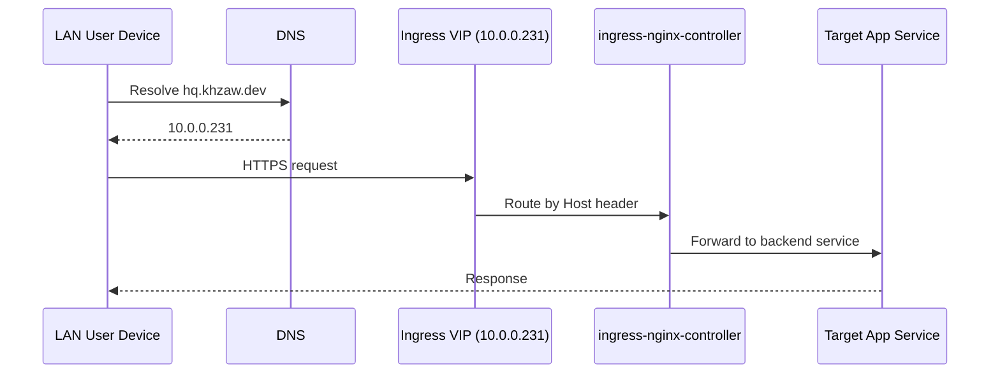
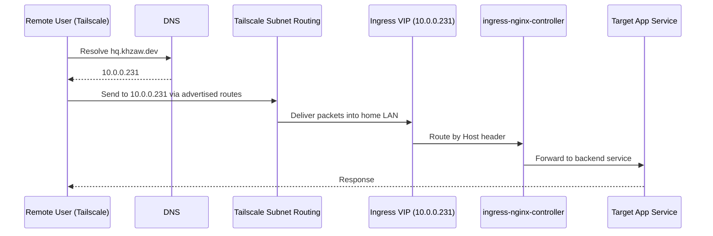
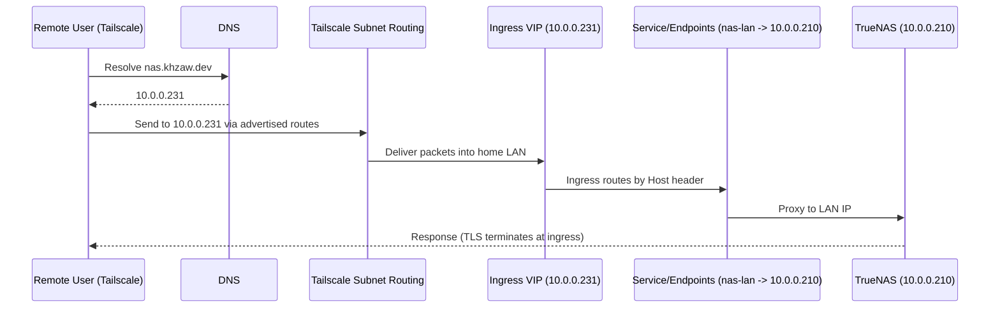

# Homelab Access Architecture: Current Setup and Simplification Strategy

## Purpose
This document explains the current access architecture and the "why" behind it.

Non-negotiables:
- `*.khzaw.dev` services must work on LAN.
- The same `*.khzaw.dev` services must work remotely when connected to Tailscale.
- The same model should extend to non-Kubernetes LAN services such as NAS (`10.0.0.210`) and router (`10.0.0.1`).

## Environment Snapshot (Current Baseline)
This repository now uses a unified destination model:

- Kubernetes ingress entrypoint:
  - `Service/ingress-nginx-controller` in namespace `ingress-nginx`
  - Type `LoadBalancer`
  - MetalLB external IP: `10.0.0.231`
- DNS:
  - Cloudflare records for app hostnames resolve to `10.0.0.231` (managed by external-dns)
  - LAN clients use AdGuard (`Service/adguard-dns`) at `10.0.0.233` for recursive resolution/filtering
  - LAN devices use the same destination IPs
- Tailscale:
  - Tailscale operator is deployed in the cluster
  - Subnet routing is implemented via `tailscale.com/v1alpha1 Connector`:
    - `infrastructure/tailscale-subnet-router/connector.yaml`
    - advertises `/32` host routes:
      - `10.0.0.197/32` (Talos node / Kubernetes API)
      - `10.0.0.231/32` (ingress VIP)
      - `10.0.0.210/32` (NAS)
      - `10.0.0.1/32` (router)
  - Remote tailnet clients reach the same `10.0.0.x` destinations via subnet routing
- LAN devices behind ingress (NAS/router):
  - `infrastructure/lan-gateway/` creates selectorless `Service` + `Endpoints` that point to LAN IPs
  - `Ingress` terminates TLS with cert-manager and routes to those Services

## Current Architecture (Unified Destination Model)

### Components And Their Roles
1. `ingress-nginx-controller` (MetalLB VIP `10.0.0.231`)
- Single entrypoint for all Kubernetes apps.

2. Cloudflare DNS + external-dns
- Keeps public DNS records aligned with ingress state, pointing app hostnames to `10.0.0.231`.

3. AdGuard DNS (`Service/adguard-dns`, `10.0.0.233`)
- Primary LAN recursive resolver/filter for client DNS queries.
- Forwards upstream while preserving the same app destination IP model.

4. Tailscale subnet router (`Connector`)
- Enables tailnet clients to reach `10.0.0.x` LAN destinations without a separate ingress proxy.

5. LAN gateway ingresses for NAS/router (`infrastructure/lan-gateway/`)
- Allows `nas.khzaw.dev` / `router.khzaw.dev` to terminate trusted TLS at ingress while proxying to LAN IPs.

### Data Flow

#### LAN path (apps)

#### Outside over Tailscale path (apps)

#### Outside over Tailscale path (NAS example)

## Why This Is The Baseline
- One canonical destination IP for Kubernetes apps (`10.0.0.231`) regardless of where the client sits.
- No dual-DNS behavior (no wildcard answers to a Tailscale proxy IP).
- No separate Tailscale ingress proxy workloads to keep healthy.
- Easier to reason about when debugging (DNS always points to LAN IPs; connectivity depends on routes).

## Guardrails / Known Failure Modes
- Keep host routes (`/32`) unless you explicitly want the blast radius of advertising the full LAN subnet.
- AdGuard details (router config, web-port gotcha, validation):
  - `docs/adguard-dns-stack-overview.md`
- TrueNAS + Tailscale:
  - Do not enable TrueNAS Tailscale "Accept Routes" unless you know you need it.
  - Accepting routes on the NAS can cause asymmetric routing and break NFS + TrueNAS API reachability from the node.
  - Incident write-up: `docs/truenas-tailscale-accept-routes-caused-democratic-csi-outage.md`

## Legacy (Decommissioned) Design Notes
Previously, remote access used:
- a Tailscale ingress proxy pod created via `tailscale.com/expose` on the ingress service, and
- a custom tailnet DNS server that returned `*.khzaw.dev -> <Tailscale proxy IP>`.

This was functional but added moving parts and dual-resolution behavior. The current baseline removes that
indirection in favor of subnet routing to the LAN IPs.
