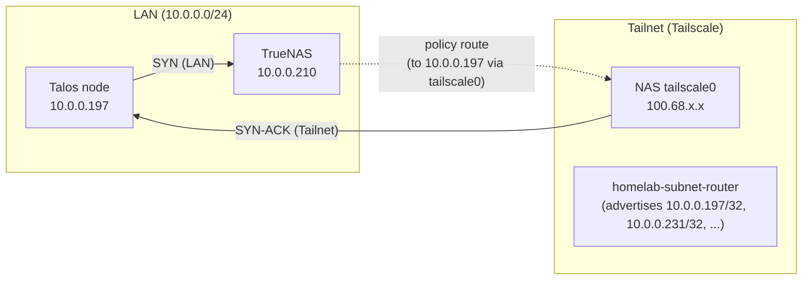

# TrueNAS + Tailscale "Accept Routes" Caused A democratic-csi Outage

## Summary
The cluster experienced a widespread outage where most apps that used NFS-backed PVCs could not start (`ContainerCreating` / mount timeouts). The underlying issue was **asymmetric routing between the Talos node and the TrueNAS host** caused by **Tailscale on the NAS accepting subnet routes** that were being advertised from the homelab tailnet.

This prevented the Kubernetes node from completing TCP handshakes to the NAS (UI/API on `80/443` and NFS on `2049`), which in turn caused `democratic-csi` to never become ready and blocked provisioning/mounting.

## Symptoms And Impact
Observed in the cluster:
- `democratic-csi-*-controller` in `CrashLoopBackOff`.
- Sidecars failing probe with:
  - `TrueNAS api is unavailable`
  - `AxiosError: timeout of 5000ms exceeded` (during `GET /api/v2.0/system/version/`)
- Many pods stuck in `ContainerCreating` due to PVC mount failures (NFS-backed `truenas-*` StorageClasses).
- From inside the cluster, connections to the NAS (`10.0.0.210`) timed out even though other LAN hosts (for example the router `10.0.0.1`) were reachable.

## Background: Why Tailscale On The NAS Matters
This homelab uses a Tailscale subnet router in Kubernetes:
- `infrastructure/tailscale-subnet-router/connector.yaml` advertises single-host routes such as:
  - `10.0.0.197/32` (Talos node / Kubernetes API)
  - `10.0.0.231/32` (MetalLB ingress IP)
  - `10.0.0.210/32` (NAS)
  - `10.0.0.1/32` (router)

The NAS also runs Tailscale for remote access.

If the NAS has **"Accept Routes"** enabled, it will **import** subnet routes from the tailnet and install policy routing (Linux routing rules and routes, often in a dedicated table such as `52`). On a LAN where the NAS can also reach those same IPs directly, this can unintentionally cause the NAS to **prefer sending replies via `tailscale0`** instead of the LAN interface.

## What Was Actually Broken (Asymmetric Routing)
The Talos node (`10.0.0.197`) could send packets to the NAS (`10.0.0.210`) over the LAN, but the NAS was returning the replies over Tailscale instead of the LAN. That breaks TCP handshakes and makes the NAS appear "down" from the node.

### Expected Path (Healthy)
1. Node sends SYN to `10.0.0.210:443` over LAN.
2. NAS replies SYN-ACK back to `10.0.0.197` over LAN.
3. Connection establishes, `democratic-csi` can probe the TrueNAS API, and NFS mounts work.

### Broken Path
1. Node sends SYN to `10.0.0.210:443` over LAN.
2. NAS selects a tailnet route for `10.0.0.197/32` and sends SYN-ACK via `tailscale0` instead of LAN.
3. Node never receives the reply on its LAN socket, so the connection times out.



## Investigation Notes (Commands And Evidence)

### 1) democratic-csi Probe Failures
The fastest signal was in the controller sidecars:
```bash
kubectl -n democratic-csi get pods -o wide
kubectl -n democratic-csi logs <controller-pod> -c external-provisioner --tail=200
```
The logs consistently showed probe failure because the driver could not reach the TrueNAS API within the probe timeout (5 seconds for `/system/version`).

### 2) Reproducing From The Cluster
Connectivity checks from both:
- a normal pod network IP (`10.244.x.x`), and
- hostNetwork (`10.0.0.197`)

showed the NAS timing out, while another LAN host (router `10.0.0.1`) responded normally.

Example probes:
```bash
ping -c 1 -W 1 10.0.0.210
nc -vz -w 2 10.0.0.210 80
nc -vz -w 2 10.0.0.210 443
nc -vz -w 2 10.0.0.210 2049
curl -m 5 -sS -o /dev/null -w "api %{http_code} total=%{time_total}\n" http://10.0.0.210/api/v2.0/system/version/
```

### 3) Packet Capture On The Node (SYN Leaves, No Reply Returns)
On the Talos node interface, `tcpdump` showed SYN packets leaving the node, but no corresponding SYN-ACK coming back.

### 4) Packet Capture On The NAS (Requests Arrive On LAN, Replies Do Not)
On TrueNAS, `tcpdump` on the LAN NIC showed the ICMP echo requests and SYN packets arriving from `10.0.0.197`, but no replies on the same interface. This is consistent with replies being routed via another interface (in this case `tailscale0`).

### 5) Confirming Policy Routing On TrueNAS
The key confirmation was:
```bash
ip route get 10.0.0.197
ip rule
ip route show table 52
```
Before the fix, `ip route get 10.0.0.197` resolved via `tailscale0` (table `52`) with a tailnet source IP, showing that the NAS would send return traffic for `10.0.0.197` over Tailscale.

Also confirmed via Tailscale localapi prefs:
```bash
PID="$(pgrep -x tailscaled)"
curl --unix-socket "/proc/$PID/root/var/run/tailscale/tailscaled.sock" \
  http://local-tailscaled.sock/localapi/v0/prefs | grep -E '"RouteAll"'
```
which reported `RouteAll: true` (accepting routes).

## Fix

### 1) Persistent Fix (Recommended): Disable "Accept Routes" On The NAS Tailscale App
In the TrueNAS SCALE UI for the Tailscale app, turn off:
- `Accept Routes`

This prevents the NAS from importing tailnet subnet routes and avoids accidental route preference over the LAN.

### 2) Immediate Fix: Disable Accept-Routes Via LocalAPI (Used During The Incident)
```bash
PID="$(pgrep -x tailscaled)"
curl -sS -X PATCH --unix-socket "/proc/$PID/root/var/run/tailscale/tailscaled.sock" \
  -H 'Content-Type: application/json' \
  -d '{"RouteAll":false,"RouteAllSet":true}' \
  http://local-tailscaled.sock/localapi/v0/prefs
```

Verify on the NAS:
```bash
ip route get 10.0.0.197
```
Expected: `dev enp1s0 src 10.0.0.210` (LAN), not `dev tailscale0 table 52`.

### 3) Restart democratic-csi Controllers To Re-Probe
Once node to NAS connectivity is restored, forcing the controller pods to restart is the fastest way to clear the crashloop state:
```bash
kubectl -n democratic-csi delete pod \
  -l app.kubernetes.io/component=controller-linux,app.kubernetes.io/instance=democratic-csi-hdd

kubectl -n democratic-csi delete pod \
  -l app.kubernetes.io/component=controller-linux,app.kubernetes.io/instance=democratic-csi-nvme
```

## Why democratic-csi Failed So Hard
`democratic-csi` is sensitive to NAS API reachability at startup:
- The controller sidecars probe the CSI driver.
- The driver `Probe` validates TrueNAS API connectivity by calling `/api/v2.0/system/version/`.
- In the `next` image, that call uses a **hard-coded 5 second timeout**.

So any routing break that makes the NAS look unreachable reliably keeps the controller in a permanent probe failure loop.

## Post-Fix Validation Checklist
Cluster:
- `kubectl -n democratic-csi get pods` shows controllers `6/6 Running`.
- New pods previously stuck on NFS PVCs move past `ContainerCreating`.

Network:
- From the Talos node context, `nc` to `10.0.0.210:2049` succeeds.
- From the NAS, `ip route get 10.0.0.197` prefers LAN (`enp1s0`).

## Prevention / Guardrails
- Keep **TrueNAS Tailscale "Accept Routes" disabled** unless you have a specific routing requirement.
- If you ever need the NAS to accept routes for another reason, add a guardrail to force LAN routing for `10.0.0.0/24` and ensure it persists across reboots (platform-specific).
- If the issue repeats after an app upgrade/restart, re-check:
  - TrueNAS Tailscale app settings (`Accept Routes`)
  - `ip route get 10.0.0.197` on the NAS

